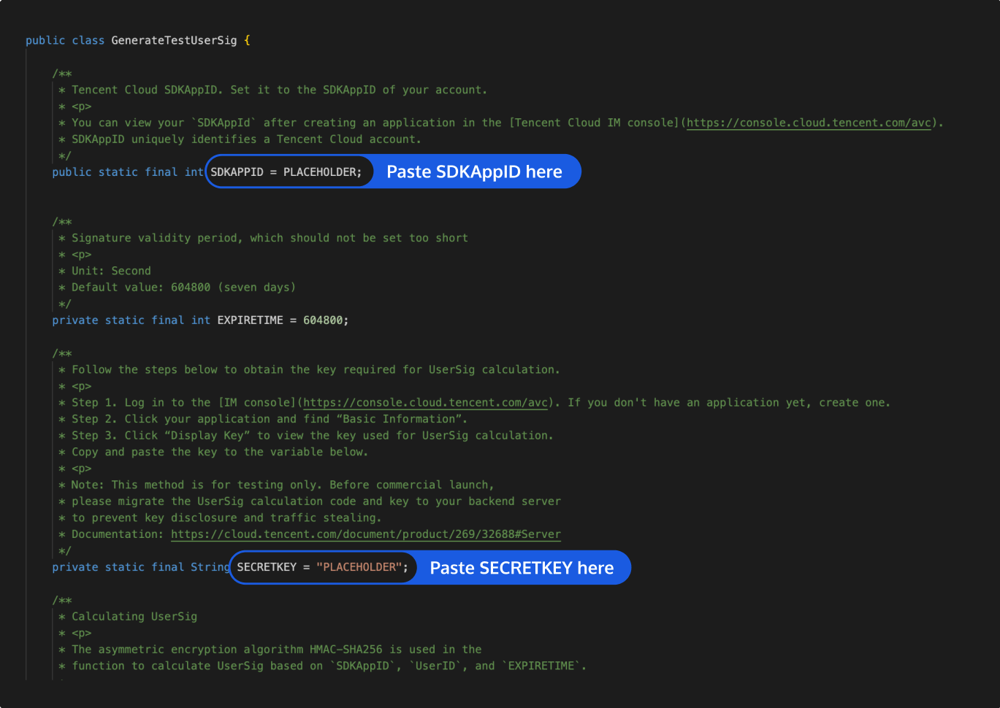

# Quick Run of TUIRoomKit Demo for Android
_[中文](README.md) | English_

This document describes how to quickly run the `TUIRoomKit` demo project to try out multi-person audio/video interactions. For more information on the TUIRoomKit component connection process, see **[Integrating TUIRoomKit (Android)](https://trtc.io/document/54843)**.


## Directory Structure

```
Android
├─ app              // Main panel, which is the entry of the multi-person audio/video interaction scenario
├─ debug            // Debugging code
├─ timcommon        // Chat interface public components
├─ tuichat          // Chat interface components
└─ tuiroomkit       // Multi-person audio/video interaction business logic
```


## Environment Requirements
- Compatibility with Android 4.4 (SDK API Level 19) or above is required. Android 5.0 (SDK API Level 21) or above is recommended
- Android Studio 3.5 or above

## Demo Run Example

### Step 1. Activate the service
1. Please refer to the official documentation at [Integration (TUIRoomKit)](https://trtc.io/document/54843) to obtain your own SDKAppID and SDKSecreKey.


[](id:ui.step2)
### Step 2. Download the source code and configure the project
1. Clone or directly download the source code in the repository. **Feel free to star our project if you like it.**
2. Find and open the `Android/debug/src/main/java/com/tencent/liteav/debug/GenerateTestUserSig.java` file.
3. Set parameters in `GenerateTestUserSig.java`:
	

	- SDKAPPID: A placeholder by default. Set it to the `SDKAppID` that you noted down in step 1.
	- SECRETKEY: A placeholder by default. Set it to the key information that you noted down in step 1.

### Step 3. Compile and run the application
You can open the source code directory `TUIRoomKit/Android` in Android Studio 3.5 or later, wait for the Android Studio project to be synced, connect to a real device, and click **Run** to try out the application.

### Step 4. Try out the demo

Note: You need to prepare at least two devices to try out TUIRoomKit. Here, users A and B represent two different devices:

**Device A (userId: 111)**

- Step 1: On the welcome page, enter the username (which must be unique), such as `111`.
- Step 2: Click **Create Room**.
- Step 3: Enter the room creation page. Note down the ID of the newly created room.
- Step 4: Enter the room.

**Device B (userId: 222)**

- Step 1: Enter the username (which must be unique), such as `222`.
- Step 2: Click **Enter Room** and enter the ID of the room created by user A (the room ID that you noted down in step 3 on device A) to enter the room.

## Have any questions?
Welcome to join our Telegram Group to communicate with our professional engineers! We are more than happy to hear from you~
Click to join: https://t.me/+EPk6TMZEZMM5OGY1
Or scan the QR code

