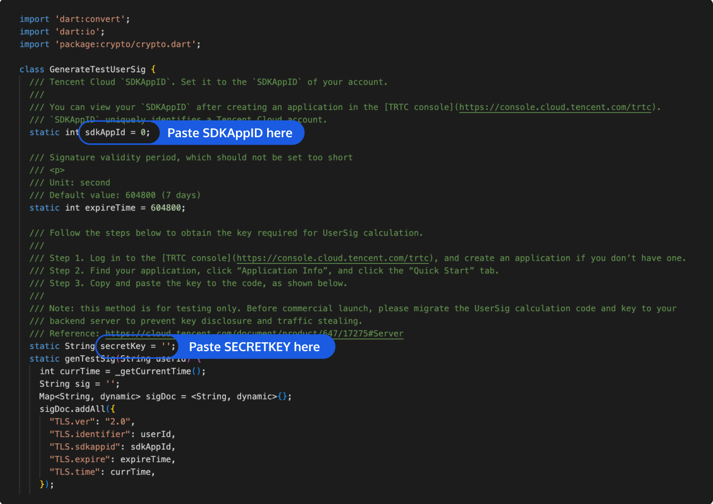

# Quick Run of TUIRoomKit Demo for Flutter

_[中文](README.zh-CN.md) | English_

This document describes how to quickly run the TUIRoomKit demo project to make a high-quality audio/video conference. For more information on the TUIRoomKit component connection process, see [**Integrating TUIRoomKit (Flutter)** ](https://trtc.io/document/57508)...

## Environment preparation

<table>
<tr>
<td rowspan="1" colSpan="1" >Platform</td>

<td rowspan="1" colSpan="1" >Version</td>
</tr>

<tr>
<td rowspan="1" colSpan="1" >Flutter</td>

<td rowspan="1" colSpan="1" >3.0.0 and above versions.</td>
</tr>

<tr>
<td rowspan="1" colSpan="1" >Android</td>

<td rowspan="1" colSpan="1" >- Android 4.1 (SDK API level 16) or later (Android 5.0 (SDK API level 21) or later is recommended).<br>- Android Studio 3.5 or later (Gradle 3.5.4 or later). <br>- Mobile phone on Android 4.1 or later.</td>
</tr>

<tr>
<td rowspan="1" colSpan="1" >iOS</td>

<td rowspan="1" colSpan="1" >iOS 12.0 and higher.</td>
</tr>
</table>


## Running the Demo

### Step 1. Activate the service
1. Please refer to the official documentation at [Integration (TUIRoomKit)](https://trtc.io/document/57508) to obtain your own SDKAppID and SDKSecretKey.

### Step 2. Configure the project

1. Open the demo project(room_flutter_example)，Find the `room_flutter_example/lib/debug/generate_test_user_sig.dart` ile in the project.
2. Set the following parameters in `generate_test_user_sig.dart`
<ul style="margin:0"><li/>SDKAPPID: `0` by default. Set it to the actual `SDKAppID`.
<li/>SDKSECRETKEY: Left empty by default. Set it to the actual key.</ul



### Step 3. Compile and run the application

in `room_flutter_example` ,Execute the following command to run the application.
```
flutter run
```

## Communication and feedback

If you have any suggestions or comments during the use of our product, please feel free to contact us at info_rtc@tencent.com or submit an [issue](https://github.com/tencentyun/TUIRoomKit/issues). Your feedback is greatly appreciated. 
