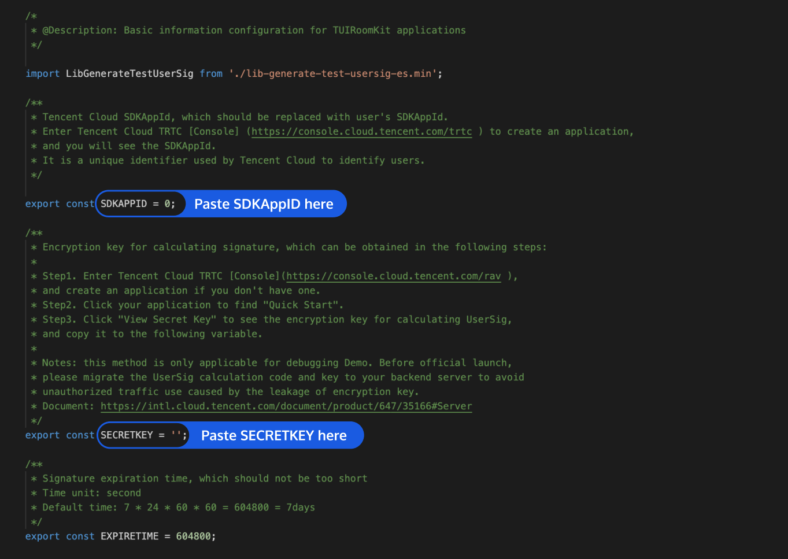

# TUIRoomKit 小程序 示例工程快速跑通

本文档主要介绍如何快速跑通 TUIRoomKit 示例工程，体验多人音视频互动，更详细的 TUIRoomKit 组件接入流程，请点击腾讯云官网文档：[TUIRoomKit 组件 uniapp（小程序） 接入说明](https://cloud.tencent.com/document/product/647/97754)。

## 环境准备

- 微信 App iOS 最低版本要求：7.0.9
- 微信 App Android 最低版本要求：7.0.8
- 小程序基础库最低版本要求：2.13.0
- 由于小程序测试号不具备 [live-pusher](https://developers.weixin.qq.com/miniprogram/dev/component/live-pusher.html) 和 [live-player](https://developers.weixin.qq.com/miniprogram/dev/component/live-player.html) 的使用权限，请使用企业小程序账号申请相关权限进行开发
- 由于微信开发者工具不支持原生组件（即 [live-pusher](https://developers.weixin.qq.com/miniprogram/dev/component/live-pusher.html) 和 [live-player](https://developers.weixin.qq.com/miniprogram/dev/component/live-player.html) 标签），需要在真机上进行运行体验

## 目录结构

```
.
├── README.md
├── CHANGELOG.md
├── wxmini_dev.sh    // 对 uniapp dev 编译后的小程序进行 npm 依赖安装
├── wxmini_prod.sh   // 对 uniapp build 编译后的小程序进行 npm 依赖安装
├── src
│   └── assets    // 示例工程静态资源
│   └── locales   // i18翻译文本相关内容
│   └── pages     // 示例主包页面
│   └── roomkit   // 示例工程分包内容
│   │   └── config   // TUIRoom 配置文件
│   │   └── pages    // 示例工程分包页面
│   │   └── TUIRoom  // TUIRoom UI 组件源文件
│   ├── router    // 自定义的 router 类
│   └── static    // sdk 资源依赖
│   ├── App.vue   // 示例工程主入口
│   ├── env.d.ts
│   ├── main.ts   // 示例工程入口文件
│   ├── manifest.json   // uniapp 配置文件
│   ├── pages.json      // uniapp 页面配置
│   ├── shime-uni.d.ts
│   ├── uni.scss
└── vite.config.ts
```
### 第一步：开通服务
请参考官网文档中 [快速接入](https://cloud.tencent.com/document/product/1690/88935) 中开通服务。

### 第二步：开通小程序权限
由于 TUIRoomKit 所使用的小程序标签有更苛刻的权限要求，因此集成 TUIRoomKit 的第一步就是要开通小程序的类目和标签使用权限，**否则无法使用**，这包括如下步骤：

- 小程序推拉流标签不支持个人小程序，只支持企业类小程序。需要在 [注册](https://developers.weixin.qq.com/community/business/doc/000200772f81508894e94ec965180d) 时填写主体类型为企业，如下图所示：
   

- 小程序推拉流标签使用权限暂时只开放给有限 [类目](https://developers.weixin.qq.com/miniprogram/dev/component/live-pusher.html)。
- 符合类目要求的小程序，需要在 **[微信公众平台](https://mp.weixin.qq.com/)** > **开发** > **开发管理** > **接口设置**中自助开通该组件权限，如下图所示：
  


### 第三步：在小程序控制台配置域名
在 **[微信公众平台](https://mp.weixin.qq.com/)** > **开发** > **开发管理** > **开发设置** > **服务器域名**中设置 **request 合法域名** 和 **socket 合法域名**，如下图所示：
- **request 合法域名**：
```javascript
https://official.opensso.tencent-cloud.com
https://yun.tim.qq.com
https://cloud.tencent.com
https://webim.tim.qq.com
https://query.tencent-cloud.com
https://web.sdk.qcloud.com
```
- **socket 合法域名**：
```javascript
wss://wss.im.qcloud.com
wss://wss.tim.qq.com
```


### 第四步：下载源码，配置工程
1. 克隆或者直接下载此仓库源码，**欢迎 Star**，感谢~~
2. 找到并打开 `MiniProgram/src/roomkit/config/basic-info-config.js` 文件。
3. 配置 `basic-info-config.js` 文件中的相关参数：
	
	- SDKAPPID：默认为 0，请设置为步第一步中记录下的 SDKAppID。
	- SECRETKEY：默认为 ''，请设置为步第一步中记录下的密钥信息。

### 第五步：快速跑通

1. 安装依赖

   ```bash
   cd MiniProgram/
   
   npm install
   ```

2. 开发环境运行示例工程

   ```bash
   npm run dev:mp-weixin
   //成功后执行 bash wxmini_dev.sh 进入小程序目录安装 npm 依赖
   bash wxmini_dev.sh
   ```

3. 打包 dist 文件

   ```bash
   npm run build:mp-weixin
   ```

4. 打开微信开发者工具，导入项目 ./MiniProgram/dist/build/mp-weixin。

5. 构建 npm，微信开发者工具【工具】->【构建 npm】。具体如下图：
   
   
  
6. 点击 **预览**，手机扫码进入小程序。


