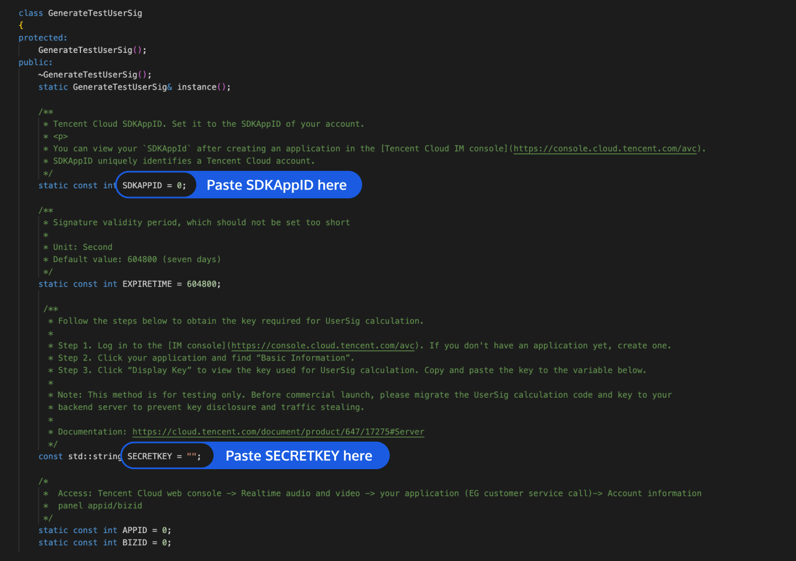

# Quick Run of TUIRoomKit Demo for Windows

_English | [简体中文](README.zh.md)_

This document describes how to quickly run the TUIRoomKit demo project to make a multi-person audio/video call. For more information on the TUIRoomKit component connection process, see:
[Integrating TUIRoomKit (Qt)](https://trtc.io/document/53567)


> [!IMPORTANT]
> The commercial version of TRTC Conference (TUIRoomKit) is coming soon. Please contact us to get a free trial of the powerful features of the commercial SDK (version 2.0). <br>
The default download on GitHub is the 2.0 version SDK. You need to contact us through the following method to activate its use:<br>
·Send an email to: chaooliang@tencent.com, please be sure to include the SDKAPPID in your email, so we can quickly respond and activate it for you.(Recommended for a quick response)<br>
·Join the Telegram group: https://t.me/+EPk6TMZEZMM5OGY1?s_url=https%3A%2F%2Ftrtc.io.

## Directory Structure

```
TUIRoomKit
├─ RoomKit              // Main program directory
   ├─ App               // Program source code
   ├─ bin               // Executable files output by the project and program database files required for debugging
   ├─ Resources         // Image source files, QSS style files, and internationalization files required by `RoomKit`
   └─ 3rdParty          // Third-party libraries depended on by `RoomKit`
├─ Common               // General class of `RoomKit`
├─ utils                // Tool class folder
├─ Module               // Data model interaction layer source code of `RoomKit`
└─ SDK                  // Liteav SDK and IM SDK library files depended on by `RoomKit`
```

## Environment Requirements
#### Windows
- Integrated development environment: Visual Studio 2015 or later.
- Qt 5.9.1 or later.
- Qt Visual Studio Tools 2.2.0 or later.
- Operating system: Windows 8 or later.
- Make sure that you can develop the project normally in the integrated development environment.

## Demo Run Example

###  Activate the service
Please refer to the official documentation at [Integration (TUIRoomKit)](https://trtc.io/document/53567) to obtain your own SDKAppID and SDKSecreKey.

### Integrating SDK
1. The project integrates the SDKs for Windows by default. For more information on the specific SDK features, see [SDK Download](https://cloud.tencent.com/document/product/647/32689).
2. After downloading the latest SDKs for Windows from the official website, you need to move them to the corresponding directory in the SDK folder under the project.

### Downloading source code and configuring the project file
Clone or directly download the source code in the repository. **Feel free to star our project if you like it.**

#### Windows
1. Open the source code project `RoomKit.vcxproj` with Visual Studio 2015 or later.
2. Find the `TUIRoomKit\Qt\utils\usersig\win\GenerateTestUserSig.h` file in the project.
3. Set parameters in the `GenerateTestUserSig.h` file.
   <ul>
   <li>SDKAPPID: 0 by default. Replace it with your actual `SDKAPPID`.</li>
   <li>SECRETKEY: An empty string by default. Replace it with your actual `SECRETKEY`.</li>
   </ul>
   
4. Return to the TRTC console and click **Next**.
5. Click **Return to Overview Page**.

>In this document, the method to obtain UserSig is to configure a SECRETKEY in the client code. In this method, the SECRETKEY is vulnerable to decompilation and reverse engineering. Once your SECRETKEY is leaked, attackers can steal your Tencent Cloud traffic. Therefore, **this method is only suitable for locally running a demo project and feature debugging**.
>The correct `UserSig` distribution method is to integrate the calculation code of `UserSig` into your server and provide an application-oriented API. When `UserSig` is needed, your application can send a request to the business server for a dynamic `UserSig`. For more information, see [How do I calculate `UserSig` during production?](https://intl.cloud.tencent.com/document/product/647/35166).

### Running the application
Make sure that the Qt environment configuration is normal.
#### Windows
- On Windows, open the source code project `RoomKit.vcxproj` with Visual Studio 2015 or later.
- Right-click the project and select **Properties** > **QtProjectSetting** > **General** > **QtInstallation** to select an installed Qt environment.

   

- Click **Run** to start debugging and running this application.

### Trying out application (**at least two devices required**)


#### User A
- Step 1: Log in to the application, enter the username and room ID (the username must be unique, such as `user_A`; the room ID can contain up to nine digits, such as `123456`), and click **Enter room**.
- Step 2: Check the device conditions on the device check page, complete the relevant settings, and click **Enter room**.
- Step 3: Enter the room successfully and become the anchor (the first user entering a room will become the anchor).

#### User B
- Step 1: Log in to the application, enter the username and room ID (the username must be unique, such as `user_B`; the room ID can contain up to nine digits, such as `123456`), and then click **Enter room**.
- Step 2: Check the device conditions on the device check page, complete the relevant settings, and click **Enter room**.
- Step 3: Enter the room successfully. The speaker list is displayed, where `user_A` can be viewed and called.

## Have any questions?
Welcome to join our Telegram Group to communicate with our professional engineers! We are more than happy to hear from you~
Click to join: https://t.me/+EPk6TMZEZMM5OGY1
Or scan the QR code

