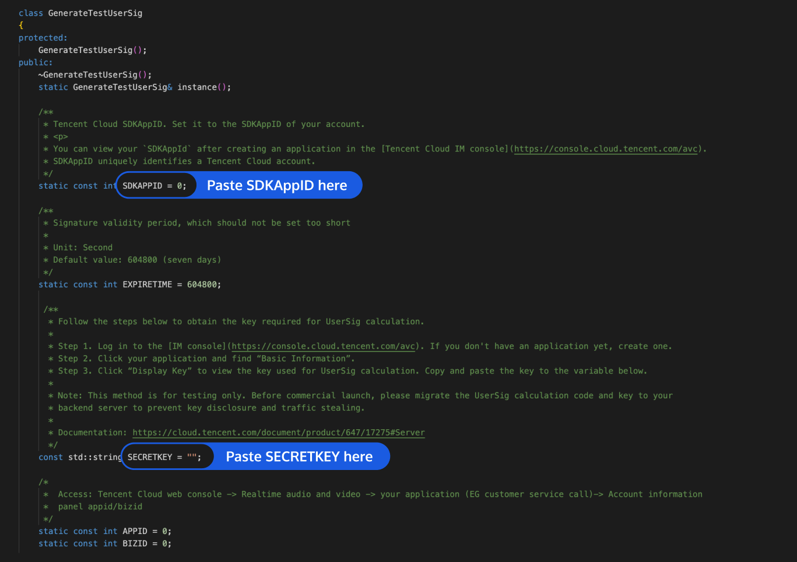

# TUIRoomKit Qt 示例工程快速跑通

_[English](README.md) | 简体中文_

本文档主要介绍如何快速跑通TUIRoom 示例工程，多人音视频通话，更详细的TUIRoomKit组件接入流程，请点击腾讯云官网文档:
[TUIRoomKit组件Qt接入说明](https://cloud.tencent.com/document/product/647/63494)

## 目录结构

```
TUIRoomKit
├─ RoomKit              // 程序的主目录
   ├─ App               // 程序的源代码
   ├─ bin               // 工程输出的可执行文件和调试所需的程序数据库文件
   ├─ Resources         // RoomKit所需的图片资源文件、QSS样式文件以及国际化翻译文件
   └─ 3rdParty          // RoomKit所依赖的第三方库
├─ Common               // RoomKit的通用类
├─ utils                // 工具类文件夹
├─ Module               // RoomKit的数据模型交互层源代码
└─ SDK                  // RoomKit所依赖的Liteav SDK库文件和IM SDK库文件
```

## 环境准备
#### Windows环境 ：
- Visual Studio 2015及以上集成开发环境。
- QT5.9.1及以上版本的Qt开发库。
- VS下的QT开发插件Qt Visual Studio Tools 2.2.0及以上。
- 最低支持系统：Windows 8。
- 请确保您的集成开发环境能够正常开发。

## 运行示例

### 开通服务
请参考官网文档中 [快速接入](https://cloud.tencent.com/document/product/1690/88936) 中获取自己的SDKAppID和SDKSecreKey。

### 下载源码，配置工程文件
克隆或者直接下载此仓库源码，欢迎 Star，感谢~~

#### Windows端的配置
1. 使用Visual Studio(VS 2015及以上)打开源码工程`RoomKit.vcxproj`。
2. 工程内找到`TUIRoomKit\Qt\utils\usersig\win\GenerateTestUserSig.h`文件 。
3. 设置`GenerateTestUserSig.h`文件中的相关参数：
   <ul>
   <li>SDKAPPID：默认为 0 ，请设置为实际申请的SDKAPPID。</li>
   <li>SECRETKEY：默认为空字符串，请设置为实际申请的SECRETKEY。</li>
   </ul>
   
4. 返回实时音视频控制台，单击【粘贴完成，下一步】。
5. 单击【关闭指引，进入控制台管理应用】。

>本文提到的生成 UserSig 的方案是在客户端代码中配置 SECRETKEY，该方法中 SECRETKEY 很容易被反编译逆向破解，一旦您的密钥泄露，攻击者就可以盗用您的腾讯云流量，因此**该方法仅适合本地跑通工程和功能调试**。
>正确的 UserSig 签发方式是将 UserSig 的计算代码集成到您的服务端，并提供面向 App 的接口，在需要 UserSig 时由您的 App 向业务服务器发起请求获取动态 UserSig。更多详情请参见 [服务端生成 UserSig](https://cloud.tencent.com/document/product/647/17275#Server)。

### 运行 App
请先确保qt环境配置正常
#### Windows端:
- Windows端使用Visual Studio（VS 2015及以上版本）打开源码工程 `RoomKit.vcxproj`，
- 在项目右键>>属性>>QtProjectSetting>>General>>QtInstallation 重新选择一下目前已经安装的Qt环境

   

- 单击【运行】即可开始调试运行本App。

### 体验应用（**体验应用至少需要两台设备**）


#### 用户 A
- 步骤一：登录输入用户名与房间号，点击进入房间按钮。(用户名请保证唯一性，例如：user_A，房间号为数字组合，最多不超过9位，例如：123456)
- 步骤二：设备检测页面检查设备，进房前设置完成后点击进入房间按钮。
- 步骤三：进入房间成功，成为主持人。(第一个进入房间的为主持人)

#### 用户 B
- 步骤一：登录输入用户名与房间号，点击进入房间按钮。(用户名请保证唯一性，例如：user_B，房间号为数字组合，最多不超过9位，例如：123456)
- 步骤二：设备检测页面检查设备，进房前设置完成后点击进入房间按钮。
- 步骤三：进入房间成功，显示麦上列表，可以看到user_A并进行会话。

## 常见问题

>? 更多帮助信息，详见 [TUI 场景化解决方案常见问题](https://cloud.tencent.com/developer/article/1952880)，欢迎加入 QQ 群：876797387，进行技术交流和反馈~