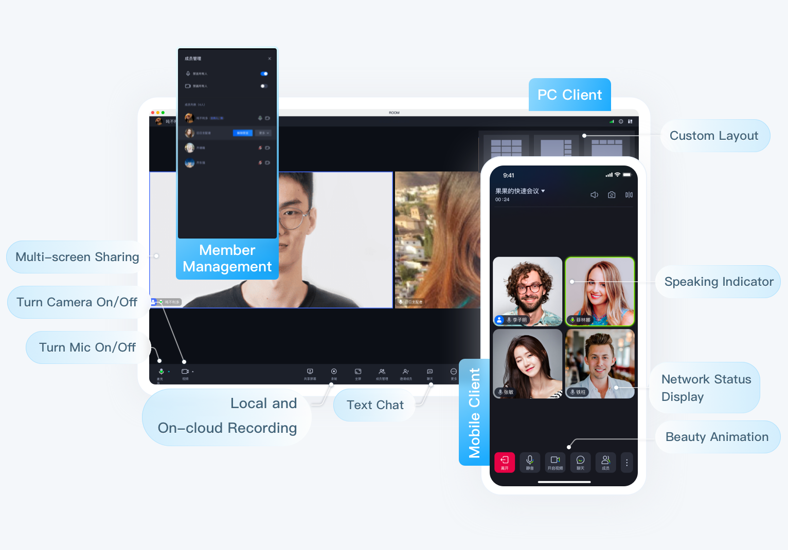

<!--
 * @Author: abyyxwang
 * @Date: 2022-12-16 10:40:40
 * @LastEditors: abyyxwang
 * @LastEditTime: 2022-12-16 10:41:32
 * @Description: 
-->
English | [简体中文](README.zh.md)
# Tencent Cloud UIKit for Video Conference

  TUIRoomKit is Tencent Cloud launched a positioning enterprise meeting, online class, network salon and other scenes of the UI component, through the integration of the component, you only need to write a few lines of code can add similar video conference functions for your App, and support screen sharing, member management, ban the ban painting, chat and other functions. TUIRoomlKit supports Windows, Mac, Android, iOS, Web, Electron and other development platforms.

  

> [!IMPORTANT]
> The commercial version of TRTC Conference (TUIRoomKit) is coming soon. Please contact us to get a free trial of the powerful features of the commercial SDK (version 2.0).  
The default download on GitHub is the 2.0 version SDK. You need to contact us through the following method to activate its use: 
·Send an email to: chaooliang@tencent.com, please be sure to include the SDKAPPID in your email, so we can quickly respond and activate it for you.(Recommended for a quick response) 
·Join the Telegram group: https://t.me/+EPk6TMZEZMM5OGY1?s_url=https%3A%2F%2Ftrtc.io.

## Features

  

- Easy access: Provide open source components with UI, save 90% development time, fast online video conference function.
- Platform connectivity: TUIRoomKit components of all platforms are interconnected and accessible.
- Screen sharing: Based on the screen acquisition capability of each platform jointly polished by 3000+ market applications, with exclusive AI coding algorithm, lower bit rate and clearer picture.
- Member management: It supports multiple standard room management functions such as all mute, single member gag, drawing, inviting to speak, kicking out of the room, etc.
- Other features: Support room members chat screen, sound Settings and other features, welcome to use.

## Make a first video Conference 

Here is an example of integration with UI (ie TUIRoomKit), which is also our recommended integration method. The key steps are as follows:
- **Step1**：Refer to the official website document to quickly connect TUIRoomKit to your project, the detailed access process of each platform/framework: [Web](https://trtc.io/document/54845) 、[Android ](https://trtc.io/document/54843)、 [iOS](https://trtc.io/document/54842)、 [Electron](https://trtc.io/document/54844)、[Flutter](https://trtc.io/document/57508)、[Windows](https://trtc.io/document/53567)
- **Step2**：Create your first multiplayer video conference.

## Quick link
- If you encounter difficulties, you can refer to [FAQs](https://trtc.io/document/54894), here are the most frequently encountered problems of developers, covering various platforms, I hope you can Help you solve problems quickly.
- If you would like to see more official examples, you can refer to the example Demo of each platform: [Web](Web/), [Android](Android/), [iOS](iOS/).

- If you would like to see some of our latest product features, you can check the [Update Log](https://trtc.io/document/54634), here are the latest features of TUICallKit, as well as the historical version features iterate
- For complete API documentation, see [Audio Video Call SDK API Example](https://trtc.io/document/54877): including TUICallKit (with UIKit), TUICallEngine (without UIKit), and call events Callbacks, etc.
- If you want to learn more about the projects maintained by Tencent Cloud  Media Services Team, you can check our [Product Official Website](https://cloud.tencent.com/product/rtcube), [Github Organizations](https://github .com/LiteAVSDK) etc.

## Have any questions?
- Welcome to submit [**issue**](https://github.com/tencentyun/TUIRoomKit/issues)  
- Welcome to join our Telegram Group to communicate with our professional engineers! We are more than happy to hear from you，Click to join: https://t.me/+EPk6TMZEZMM5OGY1
Or scan the QR code 

