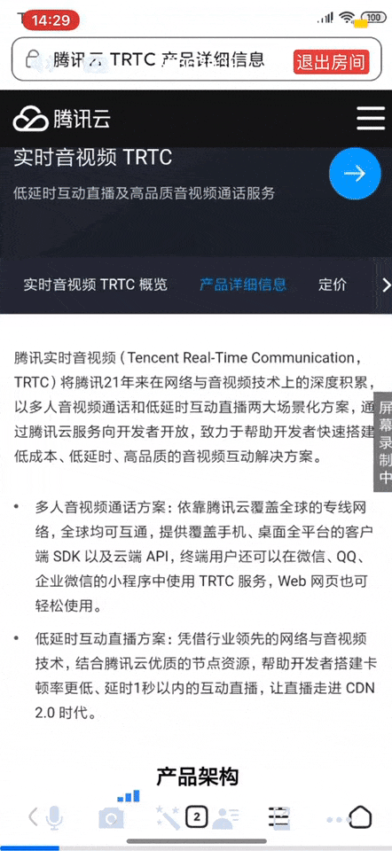

# 多人视频会议

## 效果演示

<table>
     <tr>
         <th>进入会议</th>  
         <th>屏幕分享</th>  
     </tr>
<tr>
<td></td>
<td></td>
</tr>
</table>

## 应用地址

### iOS

- [APPStore 体验地址](https://itunes.apple.com/cn/app/id1400663224?mt=8)

### Android

- [应用宝体验地址](https://android.myapp.com/myapp/detail.htm?apkName=com.tencent.trtc&ADTAG=mobile)

## 官网文档链接

- [多人视频会议（iOS）](https://cloud.tencent.com/document/product/647/45681)
- [多人视频会议（Android）](https://cloud.tencent.com/document/product/647/45667)

## SDK下载链接

腾讯云 TRTC SDK 基于 LiteAVSDK 统一框架设计和实现，该框架包含直播、点播、短视频、RTC、AI美颜在内的多项功能。

访问 Github 较慢的客户可以考虑使用国内下载地址： [DOWNLOAD](https://cloud.tencent.com/document/product/647/32689) 。

| 所属平台 | Zip下载 | SDK集成指引 | API 列表 |
|:---------:| :--------:|:--------:|:--------:|
| iOS | [下载](https://liteav.sdk.qcloud.com/download/latest/TXLiteAVSDK_TRTC_iOS_latest.zip)|[DOC](https://cloud.tencent.com/document/product/647/32173) | [API](https://cloud.tencent.com/document/product/647/32258) |
| Android | [下载](https://liteav.sdk.qcloud.com/download/latest/TXLiteAVSDK_TRTC_Android_latest.zip)| [DOC](https://cloud.tencent.com/document/product/647/32175) | [API](https://cloud.tencent.com/document/product/647/32267) |
| Win(C++)| [下载](https://liteav.sdk.qcloud.com/download/latest/TXLiteAVSDK_TRTC_Win_latest.zip)| [DOC](https://cloud.tencent.com/document/product/647/32178) | [API](https://cloud.tencent.com/document/product/647/32268) |
| Win(C#)| [下载](https://liteav.sdk.qcloud.com/download/latest/TXLiteAVSDK_TRTC_Win_latest.zip)| [DOC](https://cloud.tencent.com/document/product/647/32178) | [API](https://cloud.tencent.com/document/product/647/36776) |
| Mac| [下载](https://liteav.sdk.qcloud.com/download/latest/TXLiteAVSDK_TRTC_Mac_latest.tar.bz2)| [DOC](https://cloud.tencent.com/document/product/647/32176) |[API](https://cloud.tencent.com/document/product/647/32258) |
| Web | [下载](https://web.sdk.qcloud.com/trtc/webrtc/download/webrtc_latest.zip)| [DOC](https://cloud.tencent.com/document/product/647/16863) |[API](https://cloud.tencent.com/document/product/647/17249) |
| Electron | [下载](https://web.sdk.qcloud.com/trtc/electron/download/TXLiteAVSDK_TRTC_Electron_latest.zip) | [DOC](https://cloud.tencent.com/document/product/647/38549) |[API](https://cloud.tencent.com/document/product/647/38551) |
| 微信小程序 | [下载](https://web.sdk.qcloud.com/trtc/miniapp/download/trtc-room.zip) | [DOC](https://cloud.tencent.com/document/product/647/32183) |[API](https://cloud.tencent.com/document/product/647/17018) |

## 其它场景

- [实时语音/视频通话](https://github.com/tencentyun/MLVBSDK)
- [视频互动直播](https://github.com/tencentyun/MLVBSDK)
- [语音聊天室](https://github.com/tencentyun/MLVBSDK)
- [语音沙龙](https://github.com/tencentyun/MLVBSDK)

## 意见反馈

欢迎加入QQ群进行技术交流和反馈问题，QQ群:592465424

