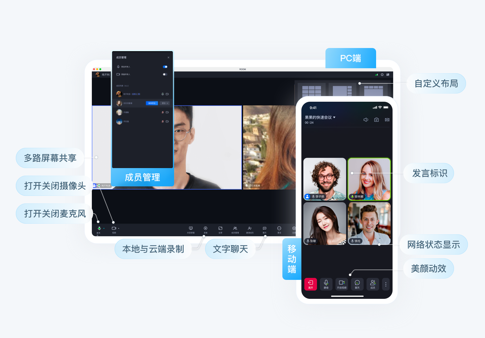

_[English](README.md) | 简体中文_
# 腾讯云 · 多人音视频房间解决方案

  TUIRoomKit 是腾讯云推出一款定位 企业会议、在线课堂、网络沙龙等场景的 UI 组件，通过集成该组件，您只需要编写几行代码就可以为您的 App 添加类似视频会议功能，并且支持屏幕分享、成员管理，禁麦禁画、聊天弹幕等功能。TUIRoomlKit 支持 Windows、Mac、Android、iOS、Web、Electron 等多个开发平台。

  

> TUIRoomKit于2022.12.16日更新上线，目前处于限免公测期，UI开源免费使用，组件内部SDK提供的房间管理、麦控等能力暂不收取使用费用，但使用过程中产生的即时通信 IM 与 实时音视频 TRTC 消耗仍会正常收费，详情见下图：
> 若未来多人音视频 SDK（TUIRoomKit）的计费方式、功能和限免公测时间等有所变更，我们将提前在官网发布公告进行说明，并通过站内信、短信、邮件等多种方式提前通知您，敬请关注。
<image src="https://qcloudimg.tencent-cloud.cn/raw/d7cc415af767a462efef414849255ea9.svg">

## 产品特性

  

- 接入方便：提供带 UI 的开源组件，节省90%开发时间，快速上线在线视频会议功能。
- 平台互通：各平台的 TUIRoomKit 组件互联互通，沟通无障碍；
- 屏幕分享：基于3000+家市场应用共同打磨的各平台屏幕采集能力，搭配专属AI 编码算法，更低码率更清晰的画面；
- 成员管理：支持全体静音、单一成员禁言禁画、邀请发言、踢出房间等多个标准的房间管理功能；
- 其他特性：支持房间成员聊天弹幕、音乐播放、音效设置、基础美颜等其他特性，欢迎使用；

## 开始使用

这里以 含 UI 的集成（即TUIRoomKit）为例，这也是我们推荐的集成方式，关键步骤如下：
- **Step1**：参考官网文档快速接入 TUIRoomKit 到您的项目中，各平台/框架详细的接入流程：[Web](https://cloud.tencent.com/document/product/1640/81132) 、[Android ](https://cloud.tencent.com/document/product/647/78729)、 [iOS](https://cloud.tencent.com/document/product/647/78730)、 [微信小程序](https://cloud.tencent.com/document/product/647/78733)、[uni-app](https://cloud.tencent.com/document/product/647/78732)
- **Step2**：创建您的第一个多人音视频房间！

## 快速访问

- 如果你遇到了困难，可以先参阅 [常见问题](https://cloud.tencent.com/document/product/647/78767)，这里整理开发者最常出现的问题，覆盖各个平台，希望可以帮助您快速解决问题
- 如果你想了解更多官方示例，可以参考各平台的示例 Demo：[Web](Web/)、[Android](Android/)、[iOS](iOS/)、[微信小程序]([MiniProgram](https://github.com/MinTate/TUICallKit/tree/main/MiniProgram)/)
- 如果您想了解我们最新的一些产品特性，可以查看 [更新日志](https://cloud.tencent.com/document/product/647/80931)，这里有 TUIRoomKit 最新的功能特性，以及历史版本功能迭代
- 完整的 API 文档见 [音视频通话 SDK API 示例](https://cloud.tencent.com/document/product/647/78748)：包含TUIRoomKit（含 UI）、TUIRoomEngine（无 UI）、以及通话事件回调等介绍。
- 如果你想了解更多腾讯云音视频团队维护的项目，可以查看我们的 [产品官网](https://cloud.tencent.com/product/rtcube)、[Github Organizations](https://github.com/LiteAVSDK) 等

## 交流&反馈
如果您在使用过程中有遇到什么问题，欢迎提交 [**issue**](https://github.com/tencentyun/TUICallKit/issues)，我们也欢迎您加入我们的开发者QQ群进行技术交流和反馈问题，QQ群 ID：592465424.

