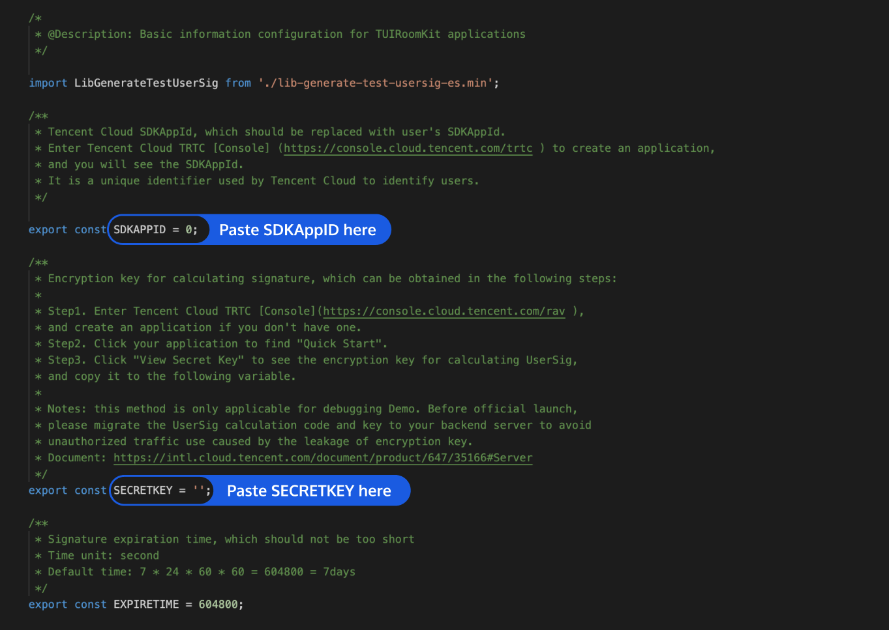

# TUIRoomKit Web 示例工程快速跑通

_[English](README.EN.md) | 简体中文_

本文档主要介绍如何快速跑通 TUIRoomKit 示例工程，体验多人音视频互动，更详细的 TUIRoomKit 组件接入流程，请点击腾讯云官网文档：[TUIRoomKit 组件 Web 接入说明](https://cloud.tencent.com/document/product/647/81962)...

## 目录结构

```
.
├── README.md
├── auto-imports.d.ts
├── components.d.ts
├── index.html
├── src
│   ├── App.vue   // 示例工程主页面
│   ├── TUIRoom   // TUIRoom UI 组件源文件
│   ├── assets    // 公共资源
│   ├── config    // TUIRoom 配置文件
│   ├── env.d.ts
│   ├── main.ts   // 示例工程入口文件
│   ├── router    // 示例工程路由配置
│   └── views     // 示例工程路由页面
└── vite.config.ts
```
### 第一步：开通服务
请参考官网文档中 [快速接入](https://cloud.tencent.com/document/product/1690/88934) 中获取自己的SDKAppID和SDKSecreKey。

### 第二步：下载源码，配置工程
1. 克隆或者直接下载此仓库源码，**欢迎 Star**，感谢~~
2. 找到并打开 `Web/vue3/src/config/basic-info-config.js` 文件。
3. 配置 `basic-info-config.js` 文件中的相关参数：
	
	- SDKAPPID：默认为 0，请设置为步第一步中记录下的 SDKAppID。
	- SECRETKEY：默认为 ''，请设置为步第一步中记录下的密钥信息。

### 第三步：运行示例

1. 安装依赖

   ```bash
   cd TUIRoomKit/Web/vue3
   
   npm install
   ```

2. 开发环境运行示例工程

   ```bash
   npm run dev
   ```

3. 打包 dist 文件

   ```bash
   npm run build
   ```
### 第四步：示例体验

开发环境运行示例工程后，在浏览器中打开页面 http://localhost:3000/#/home 即可体验 TUIRoomKit 功能。

注意：因 TUIRoomKit 按需引入 element-plus 组件，会导致开发环境路由页面第一次加载时反应较慢，等待 element-plus 按需加载完成即可正常使用。element-plus 按需加载不会影响打包之后的页面加载。

**主持人（userId：anchor）**

- 步骤1、在 home 页面，点击【创建房间】按钮；
- 步骤2、进入 TUIRoomKit 房间；

| 步骤1 | 步骤2 |
|---------|---------|
|  |  |

**普通成员（userId：audience）**

- 步骤1、在 home 页面，输入主持人创建的房间 Id，点击【加入房间】按钮；
- 步骤2、加入房间；

| 步骤1 | 步骤2 |
|---------|---------|
|  |  |

### 第五步：生产环境部署
- 步骤一：打包 dist 文件

   ```bash
   npm run build
   ```
- 步骤二： 部署 dist 文件到服务器上

>! 生产环境要求使用 https 域名


## 常见问题

### Q：项目打包之后部署到测试/生产环境，无法正常使用麦克风和摄像头是什么原因呢？

A: 请检查部署的链接是否为 https 协议，出于对用户安全、隐私等问题的考虑，浏览器限制网页在 https 协议下才能正常使用 TRTC Web SDK（WebRTC）的全部功能。


## 其他

- 欢迎加入 QQ 群：592465424，进行技术交流和反馈~
