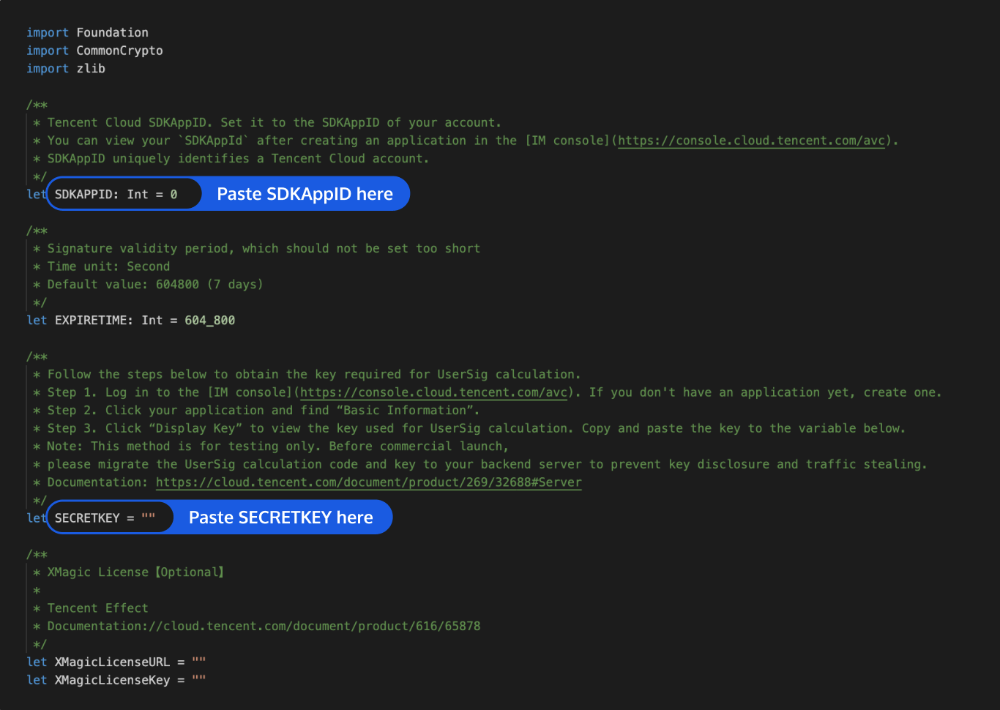

# TUIRoomKit iOS 示例工程快速跑通

_中文 | [English](README.en.md)_

本文档主要介绍如何快速跑通TUIRoomKit 示例工程，体验高质量多人视频会议，更详细的TUIRoomKit组件接入流程，请点击腾讯云官网文档： [**TUIRoomKit 组件 iOS 接入说明** ](https://cloud.tencent.com/document/product/647/84237)...

## 目录结构

```
TUIRoomKit
├─ Example                      // 多人视频会议Demo工程
│   ├─ App                      // 进入/创建多人视频会议UI代码以及用到的图片及国际化字符串资源文件夹
│   ├─ Debug                    // 工程调试运行所需的关键业务代码文件夹
│   ├─ Login                    // 登录UI及业务逻辑代码文件夹
│   └─ TXReplayKit_Screen       // 共享屏幕逻辑代码文件夹
└─ TUIRoomKit                   // 多人视频会议主要UI代码以及所需的图片、国际化字符串资源文件夹
```

## 环境准备

iOS 13.0及更高。

## 运行并体验 App

[](id:ui.step1)
### 第一步：开通服务
请参考官网文档中 [快速接入](https://cloud.tencent.com/document/product/1690/88932) 中获取自己的SDKAppID和SDKSecreKey

### 第二步：配置工程
1. 使用Xcode(12.0及以上)打开源码工程`DemoApp.xcworkspace`。
2. 工程内找到 `iOS/Example/Debug/GenerateTestUserSig.swift` 文件。
3. 设置 `GenerateTestUserSig.swift` 文件中的相关参数：
<ul style="margin:0"><li/>SDKAPPID：默认为0，请设置为实际的 SDKAppID。
<li/>SECRETKEY：默认为空字符串，请设置为实际的密钥信息。</ul>



[](id:ui.step3)
### 第三步：编译运行

1. 打开Terminal（终端）进入到工程目录下执行`pod install`指令，等待完成。
2. Xcode（12.0及以上的版本）打开源码工程 `TUIRoomKit/iOS/Example/DemoApp.xcworkspace`，单击 **运行** 即可开始调试本 App。

[](id:ui.step4)

>? 如果您在使用过程中，有什么建议或者意见，欢迎您加入我们的 TUIKit 组件交流群 QQ 群：592465424，进行技术交流和产品沟通。


